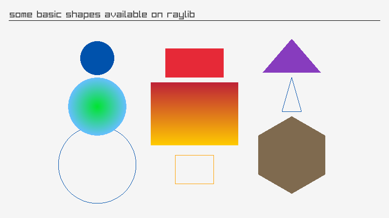
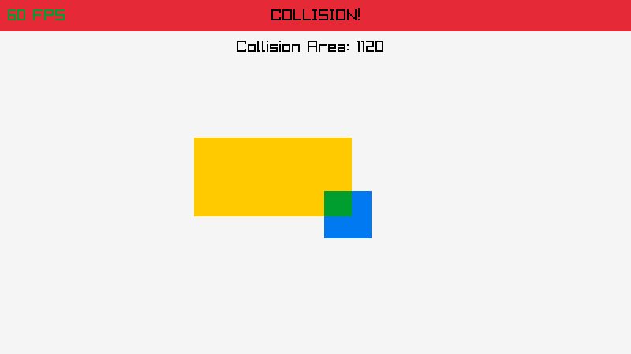
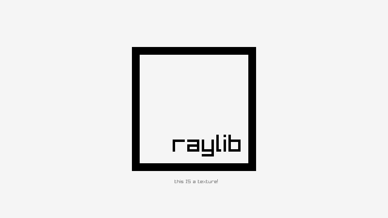
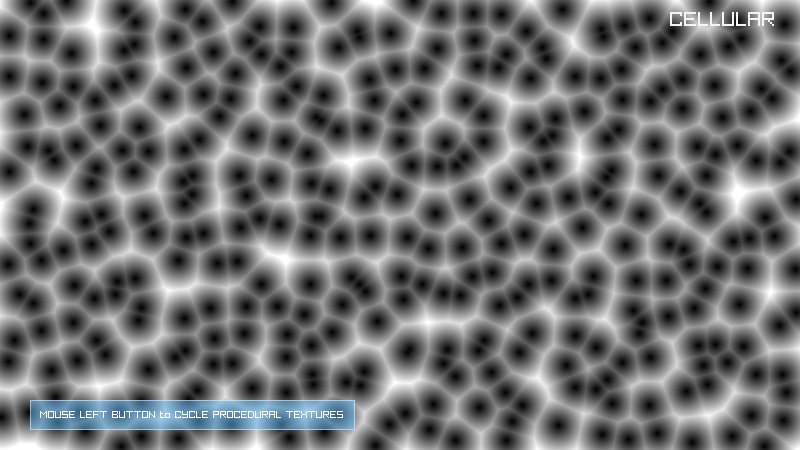
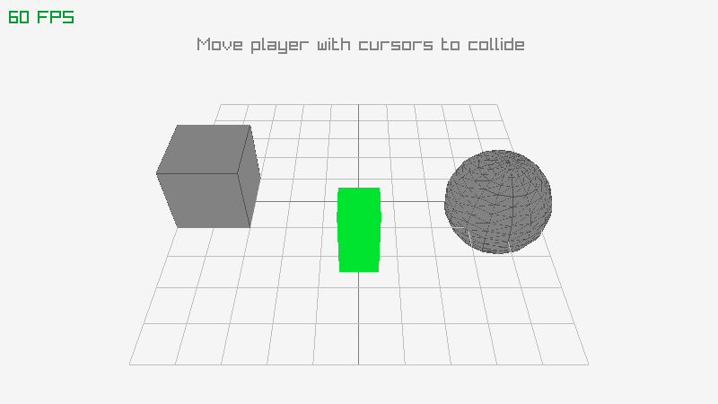
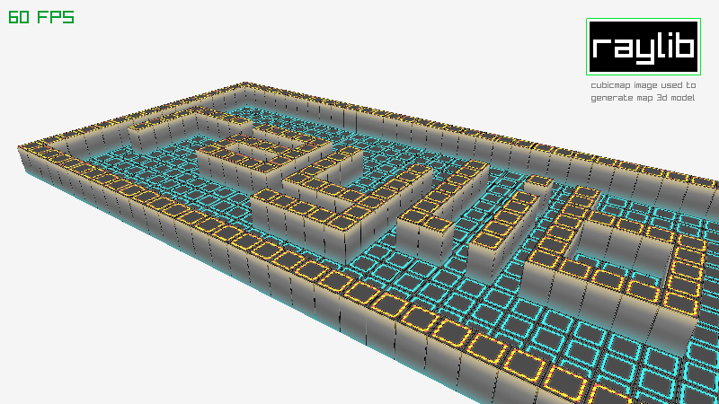
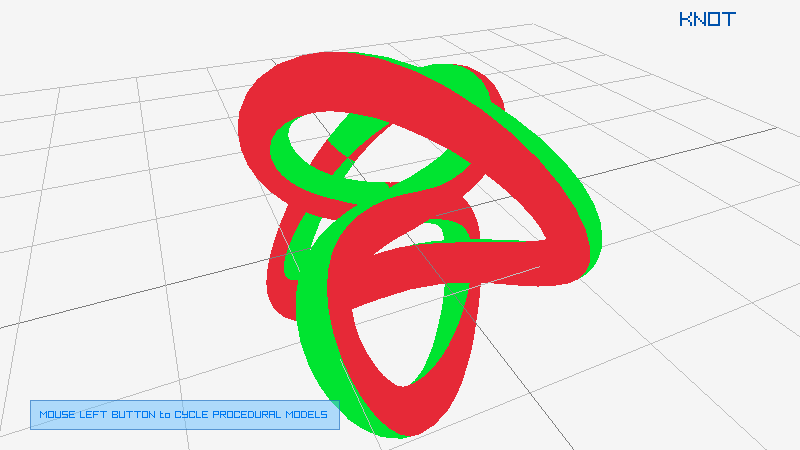

# raylib4Vita samples
raylib samples for PlayStation Vita

For compiling each sample
```
cd [sample]
mkdir build
cd build
cmake ..
make
```
For udp logs you can use debug.sh script with the content
```
echo [HOST] debugnet listener up
echo [HOST] ready to have a lot of fun!!!
socat udp-recv:18194 stdout
```
## EXAMPLES LIST

### category: shapes

Examples using raylib shapes drawing functionality, provided by raylib.

| ## | example  | image  | developer  | new |
|----|----------|--------|:----------:|:---:|
| 25 | [shapes_basic_shapes](shapes/shapes_basic_shapes/main.c)                     |                      | ray                                        | ⭐️     |
| 26 | [shapes_logo_raylib](shapes/shapes_logo_raylib/main.c)                         |                          | ray                                        |        |
| 27 | [shapes_logo_raylib_anim](shapes/shapes_logo_raylib_anim/main.c)               |                | ray                                        |        |
| 30 | [shapes_collision_area](shapes/shapes_collision_area/main.c)                   |                    | ray                                        | ⭐️     |


### category: textures

Examples using raylib textures functionality, including image/textures loading/generation and drawing, provided by raylib 

| ## | example  | image  | developer  | new |
|----|----------|--------|:----------:|:---:|
| 40 | [textures_logo_raylib](textures/textures_logo_raylib/main.c)                   |                    | ray                                              |        |
| 44 | [textures_image_generation](textures/textures_image_generation/main.c) |  | ray                                              | ⭐️     |

### category: models

Examples using raylib models functionality, including models loading/generation and drawing

| ## | example  | image  | developer  | new |
|----|----------|--------|:----------:|:---:|
| 71 | [models_box_collisions](models/models_box_collisions/main.c)                   |                    | ray                                              |        |
| 72 | [models_cubicmap](models/models_cubicmap/main.c)                               |                                | ray                                              |
| 76 | [models_mesh_generation](models/models_mesh_generation/main.c)                 |                  | ray                                              |        |

As always contributions are welcome, feel free to send new examples! Here it is an [examples template](examples_template.c) to start with!
